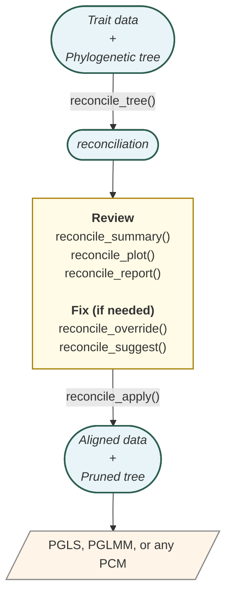

<!-- README.md is generated from README.Rmd. Please edit that file -->

# prepR4pcm 

<!-- badges: start -->

[](https://github.com/itchyshin/prepR4pcm/actions/workflows/R-CMD-check.yaml)
[](https://github.com/itchyshin/prepR4pcm/actions/workflows/pkgdown.yaml)
[](https://lifecycle.r-lib.org/articles/stages.html#stable)

[](https://doi.org/10.5281/zenodo.20618681)
<!-- badges: end -->

Phylogenetic comparative methods (PCMs) need a phylogenetic tree and a
trait dataset whose species names line up exactly with the tree’s tip
labels. **prepR4pcm** addresses both halves of that prerequisite:

1.  **Reconcile names** when the data and the tree disagree on spelling,
    formatting, or synonymy — so species aren’t silently dropped from
    the analysis.
2.  **Retrieve and date trees** from public databases when you don’t
    already have one, including posteriors of trees so the tree-choice
    uncertainty can be propagated downstream.

In phylogenetic comparative analyses, trait datasets must match exactly
the tip labels in the phylogenetic tree. Mismatches prevent the
integration of species trait data (e.g., tables) with their evolutionary
relationships (the tree), which is essential for phylogenetic
comparative methods, such as studies of trait evolution, niche
conservatism, or correlated trait change. These mismatches can lead to
species being silently excluded from analyses. There are three main
types of species name mismatches:

- **Formatting differences**, e.g. `Homo_sapiens` vs `Homo sapiens`,
  trailing whitespace, capitalisation
- **Taxonomic synonyms / different ranks**, e.g. `Homo sapiens` vs
  `Homo sapiens sapiens`, or a recent name vs the historical synonym
  used in the tree
- **Simple typos**, e.g. `Homo sapiens` vs `Hamo sapiens`

**prepR4pcm** detects and resolves all three through a multi-stage
matching cascade (exact → normalised → synonym → fuzzy), documents every
decision so the choices are auditable, and produces aligned data–tree
pairs ready for phylogenetic generalised least squares (PGLS),
phylogenetic mixed models (PGLMMs), or any other PCM.

Below you’ll find instructions for package installation, a quick
example, the typical workflow, vignettes covering realistic pipelines,
citation information, and a list of bundled example datasets.

## Installation

Install the CRAN release:

``` r
install.packages("prepR4pcm")
```

Install the development version from GitHub:

``` r
# install.packages("pak")
pak::pak("itchyshin/prepR4pcm")
```

## Features

- **Four-stage matching cascade**: exact match, normalised match (case,
  whitespace, underscores), synonym resolution via
  [taxadb](https://docs.ropensci.org/taxadb/) (Norman et al. 2020), and
  fuzzy matching with genus pre-filtering for typos.
- **Full provenance**: every name-matching decision is recorded in the
  reconciliation result, so you can audit any name change later.
  `reconcile_summary()`, `reconcile_plot()`, `reconcile_report()`, and
  `reconcile_suggest()` help you inspect matches and find near-misses.
- **Multi-tree support**: `reconcile_to_trees()` matches a dataset
  against several trees at once; `reconcile_diff()` compares results.
- **Crosswalks and overrides**: a *taxonomic crosswalk* is a published
  table mapping species names from one taxonomy to another (e.g. mapping
  BirdLife species names to the BirdTree / Jetz phylogeny names). An
  *override table* is a user-supplied two-column data frame (`name_x`,
  `name_y`) that forces specific name pairs to resolve a particular way,
  bypassing the cascade. `reconcile_crosswalk()` converts a published
  crosswalk into an override table. For automatic workflows, use
  `reconcile_crosswalk_supplement()` so one-to-one crosswalk rows
  supplement a baseline reconciliation only for names that remain
  unresolved. Keep split/lump rows separate and review them before
  applying them.
- **Tree augmentation**: an *unresolved species* is one that appears in
  your data but has no matching tip on the tree (and the cascade
  couldn’t find it via formatting, synonymy, or fuzzy matching).
  `reconcile_augment()` grafts unresolved species onto the tree as
  sister to a congener (a species in the same genus). Because this
  placement is an assumption rather than a result, you should always run
  *sensitivity analyses* — fit your downstream model both with and
  without the grafted tips and report whether the conclusions change.
- **Tree retrieval and dating**: `pr_get_tree()` fetches phylogenetic
  trees from five backends — `rotl` (Open Tree of Life), `rtrees`
  (taxon-specific mega-trees including the VertLife mammal, bird,
  squamate, and shark posteriors), `clootl` (current Clements bird
  taxonomy), `fishtree` (Rabosky et al. 2018), and `datelife` (synthesis
  chronograms). Single trees and posteriors of trees are both supported.
  `pr_date_tree()` adds time calibration via DateLife. `pr_cite_tree()`
  produces per-source citations in plain text, Markdown, or BibTeX so
  the methods paragraph writes itself.

## Typical workflow

*Starting point*: trait data + a phylogenetic tree. *If you don’t yet
have a tree*, fetch one with `pr_get_tree()` (and optionally date it
with `pr_date_tree()`) and continue from “Trait data + Phylogenetic
tree” below; see the [posterior-tree
pipeline](https://itchyshin.github.io/prepR4pcm/articles/posterior-tree-pipeline.html)
vignette for the full pattern.

The diagram below shows the steps. **R objects and data files** are in
rounded boxes; **`prepR4pcm` functions** that act on them are on the
arrows.



The first reconciliation pass produces a *reconciliation* object (an
audit of every name match). You then review and fix; once you’re happy,
`reconcile_apply()` produces the aligned dataset and pruned tree that
have matching species lists — the precondition for any phylogenetic
comparative method.

## Quick example

This example reconciles `avonet_subset` (919 species rows from AVONET, a
global bird-trait database; Tobias et al. 2022) against `tree_jetz` (657
tips from the Jetz et al. 2012 bird phylogeny). It produces an aligned
data frame and a pruned tree ready for downstream modelling — both sides
have the same species, in matched order, ready for a PGLS or
phylogenetic mixed model.

``` r
library(prepR4pcm)
library(ape)

# Reconcile a dataset against a phylogenetic tree
rec <- reconcile_tree(
  x         = avonet_subset,
  tree      = tree_jetz,
  x_species = "Species1",
  fuzzy     = TRUE,
  resolve   = "flag"
)
#> ℹ Reconciling 919 data names vs 657 tree tips
#> ℹ Matching 919 x 657 names through 4 stages...
#> ℹ Stage 1/4: Exact matching...
#> ℹ Stage 2/4: Normalised matching (0 matched so far)...
#> ℹ Stage 3/4: Synonym resolution (657 matched so far)...
#> ℹ Stage 4/4: Fuzzy matching (657 matched so far)...
#> ✔ Matched 657/919 data names to tree tips
rec
#> 
#> ── Reconciliation: data vs tree ────────────────────────────────────────────────
#>   Source x: avonet_subset
#>   Source y: phylo (657 tips)
#>   Authority: col
#>   Timestamp: 2026-07-05 12:16:43
#> ℹ Match coverage: [█████████████████████░░░░░░░░░] 71% (657/919)
#> 
#> ── Match summary ──
#> 
#> • Exact: 0 ( 0.0%)
#> • Normalized: 657 (71.5%)
#> • Synonym: 0 ( 0.0%)
#> • Fuzzy: 0 ( 0.0%)
#> • Manual: 0 ( 0.0%)
#> ! Unresolved (x only):262 (28.5%)
#> ! Unresolved (y only):0
#> ! Flagged for review: 0
#> ℹ Use `reconcile_summary()` for details, `reconcile_mapping()` for the full table.

# Apply the reconciliation: aligned data + pruned tree
aligned <- reconcile_apply(rec, data = avonet_subset, tree = tree_jetz,
                           species_col = "Species1", drop_unresolved = TRUE)
#> ! Dropped 262 rows with unresolved species from data
#> ℹ Tree has 657 tips after alignment

# Confirm the two sides hold the SAME species (not just the same count)
data_sp <- aligned$data$Species1
tree_sp <- aligned$tree$tip.label
length(intersect(data_sp, tree_sp))   # how many species are in both
#> [1] 657
length(setdiff(data_sp, tree_sp))     # in data but not tree (should be 0)
#> [1] 0
length(setdiff(tree_sp, data_sp))     # in tree but not data (should be 0)
#> [1] 0
```

What just happened: `reconcile_tree()` matched every species name in
`avonet_subset$Species1` against the tip labels of `tree_jetz`, trying
exact matches first and falling back through normalised, synonym, and
fuzzy matches as needed. The printed `rec` object shows the count in
each match category. `reconcile_apply()` then takes that reconciliation
and produces (a) a data frame with rows restricted to species that
resolved to a tree tip, and (b) the tree pruned to those tips. The
`intersect()` / `setdiff()` calls above confirm that the data’s species
names and the tree’s tip labels are *identical sets* (not just equal
counts) — the actual precondition for any downstream PGLS or PGLMM call.

## Quick example — fetching a tree

If you don’t already have a tree, fetch one. The snippet below pulls a
50-tree posterior of fish chronograms from the Fish Tree of Life
(Rabosky et al. 2018) and asks `pr_cite_tree()` to format the citations
for your methods section:

``` r
trees <- pr_get_tree(
  c("Salmo salar", "Esox lucius", "Oncorhynchus mykiss"),
  source = "fishtree",
  n_tree = 50
)
class(trees$tree)              # "multiPhylo"
length(trees$tree)             # 50

# Citations for the methods section
cat(pr_cite_tree(trees, format = "markdown"))
```

Each backend has its own coverage and quirks; the [comparing tree
backends](https://itchyshin.github.io/prepR4pcm/articles/comparing-tree-backends.html)
vignette summarises which one to pick for a given taxon and what
“`n_tree > 1`” returns in each case.

## Vignettes

- [Getting
  Started](https://itchyshin.github.io/prepR4pcm/articles/getting-started.html)
  ([source](vignettes/getting-started.Rmd)) — core concepts and a
  minimal worked example
- [Bird Trait
  Workflow](https://itchyshin.github.io/prepR4pcm/articles/bird-workflow.html)
  ([source](vignettes/bird-workflow.Rmd)) — a realistic multi-dataset,
  multi-tree analysis pipeline ending in fitting the PGLS and
  phylogenetic GLMM
- [Mammal Database-Assembly
  Workflow](https://itchyshin.github.io/prepR4pcm/articles/db-assembly-workflow_mammals.html)
  ([source](vignettes/db-assembly-workflow_mammals.Rmd)) — assembling a
  trait database from three sources (Amniote, PanTHERIA,
  TetrapodTraits), reconciling species names against a mammal phylogeny,
  and producing a model-ready species-level data frame
- [Posterior-Tree Pipeline (prepR4pcm +
  pigauto)](https://itchyshin.github.io/prepR4pcm/articles/posterior-tree-pipeline.html)
  ([source](vignettes/posterior-tree-pipeline.Rmd)) — fetching a
  posterior of trees, imputing missing trait values, and pooling
  estimates with valid standard errors via Rubin’s rules so both the
  tree-choice and imputation uncertainties are propagated
- [Comparing Tree
  Backends](https://itchyshin.github.io/prepR4pcm/articles/comparing-tree-backends.html)
  ([source](vignettes/comparing-tree-backends.Rmd)) — when do `rotl`,
  `rtrees`, `clootl`, `fishtree`, and `datelife` agree on which tree to
  give you, and what to do when they don’t
- [Phylogenetic Meta-Analysis with
  rotl](https://itchyshin.github.io/prepR4pcm/articles/meta-analysis-with-rotl.html)
  ([source](vignettes/meta-analysis-with-rotl.Rmd)) — the Cinar et
  al. 2022 recipe: fetch a topology, resolve polytomies, assign Grafen
  branch lengths, build the phylogenetic correlation matrix, feed
  `metafor::rma.mv()`

## Citation

If you use **prepR4pcm** in your research, please cite the package and
the original publication for any bundled example dataset you used (see
*Bundled data sources* below).

For the package itself:

> Nakagawa S, Ortega S, Mizuno A, Santos E, Lagisz M, Jain B, Celeste J,
> Poo Hernandez S (2026). *prepR4pcm: Prepare Data and Trees for
> Phylogenetic Comparative Methods.* R package version 1.0.0.
> <https://github.com/itchyshin/prepR4pcm>

BibTeX:

``` bibtex
@Manual{,
  title  = {prepR4pcm: Prepare Data and Trees for Phylogenetic Comparative Methods},
  author = {Shinichi Nakagawa and Santiago Ortega and Ayumi Mizuno and
            Eduardo S.A. Santos and Malgorzata Lagisz and Bhavya Jain and
            Jimuel Jr Celeste and Sergio {Poo Hernandez}},
  year   = {2026},
  note   = {R package version 1.0.0},
  url    = {https://github.com/itchyshin/prepR4pcm},
}
```

Or run in R to get the same entry programmatically:

``` r
citation("prepR4pcm")
```

If `citation("prepR4pcm")` warns *“no package ‘prepR4pcm’ was found”*,
the installed copy is stale or in a library R isn’t searching. Install
the CRAN release with `install.packages("prepR4pcm")`, or install the
development version with `pak::pak("itchyshin/prepR4pcm")`, then re-load
(restart R if needed).

## Key dependencies

- [ape](https://cran.r-project.org/package=ape) — phylogenetic tree
  handling (Paradis & Schliep 2019, *Bioinformatics* 35:526–528)
- [taxadb](https://docs.ropensci.org/taxadb/) — local taxonomic synonym
  resolution (Norman et al. 2020, *Methods in Ecology and Evolution*
  11:1153–1159)

## Bundled data sources

The package contains small sample datasets — each is a *subset* (a few
hundred rows or tips) of a larger published dataset, used only for the
package’s examples, vignettes, and tests. They are not full versions: if
you want to *do science* with these data, download the full original
dataset from the source listed below. If you use any of these examples
in published work, please cite the original provider.

**Bird data (used by the bird-workflow vignette):**

- **AVONET** (`avonet_subset`): Tobias et al. (2022) *Ecology Letters*
  25:581–597. DOI 10.1111/ele.13898
- **NestTrait v2** (`nesttrait_subset`): Chia et al. (2023) *Scientific
  Data* 10:923. DOI 10.1038/s41597-023-02837-1
- **Plumage lightness** (`delhey_subset`): Delhey et al. (2019) *Ecology
  Letters* 22:726–736. DOI 10.1111/ele.13233
- **Jetz phylogeny** (`tree_jetz`): Jetz et al. (2012) *Nature*
  491:444–448. DOI 10.1038/nature11631
- **Clements checklist** (`tree_clements25`): Clements et al. (2025)
  eBird/Clements Checklist of Birds of the World, v2025.
- **BirdLife-BirdTree crosswalk** (`crosswalk_birdlife_birdtree`):
  distributed with AVONET (Tobias et al. 2022, DOI 10.1111/ele.13898);
  maps BirdLife taxonomy to the BirdTree (Jetz et al. 2012, DOI
  10.1038/nature11631) taxonomy. Split/lump rows in this crosswalk
  represent taxonomic judgement calls and should be reviewed before
  being used as overrides. Use `reconcile_crosswalk_supplement()` when
  you want the crosswalk to supplement, rather than preempt, a baseline
  reconciliation.

**Mammal data (used by the mammal database-assembly vignette):**

- **Amniote life-history** (`mammal_amniote_example`): Myhrvold et
  al. (2015) *Ecology* 96:3109. DOI 10.1890/15-0846R.1
- **PanTHERIA** (`mammal_pantheria_example`): Jones et al. (2009)
  *Ecology* 90:2648. DOI 10.1890/08-1494.1
- **TetrapodTraits** (`mammal_tetrapodtraits_example`): Moura et al.
  2024) *PLOS Biology* 22:e3002658. DOI 10.1371/journal.pbio.3002658
- **Mammal phylogeny** (`mammal_tree_example`): a 5,987-tip subset of
  the VertLife mammal phylogeny from Upham et al. (2019) *PLOS Biology*
  17(12):e3000494 DOI 10.1371/journal.pbio.3000494. Bundled as an
  example object only — for analysis-grade trees, download the full
  credible set from <https://vertlife.org/phylosubsets/>.

## License

MIT
